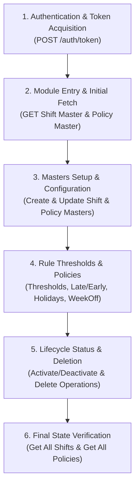

# Attendance Management API — Complete End-to-End Timeline Guide

This document presents the **Chronological Execution Timeline** for testing the complete Attendance Management lifecycle in **Bruno** or **Postman**. It orders the APIs step-by-step from initial employee login $\rightarrow$ entering the Attendance module $\rightarrow$ configuring masters $\rightarrow$ establishing threshold & policy rules $\rightarrow$ lifecycle status toggles.

---

## ⏳ Complete End-to-End Execution Timeline Overview



---

## ⏱️ Chronological Step-by-Step API Execution Guide

---

### 🔹 STEP 1 — Employee Login & Token Acquisition

**Objective**: Authenticate employee credentials and capture the `authToken` required for all downstream API calls.

* **API**: `POST {{authBaseUrl}}/auth/token`
* **Headers**: `Content-Type: application/json`
* **Request Payload**:
  ```json
  {
    "empCode": "{{empCode}}",
    "password": "{{empPassword}}"
  }
  ```
* **Expected Response (`200 OK`)**:
  ```json
  {
    "status": "SUCCESS",
    "data": {
      "empCode": "OMI-0076",
      "token": "<JWT redacted - the run writes this into {{authToken}}>"
    }
  }
  ```
* **Bruno Post-Response Script**:
  ```javascript
  if (res.status === 200 && res.body && res.body.data && res.body.data.token) {
    bru.setVar("authToken", res.body.data.token);
  }
  ```

---

### 🔹 STEP 2 — Entering Attendance Management Module (Initial Fetch Phase)

**Objective**: Load existing shift configurations and attendance policies upon navigating to `/hcm/attendance`.

* **API 2.1 — Fetch Existing Shifts**: `GET {{attendanceBaseUrl}}/api/v1/attendance/shift/master?page=0&includeDeleted=true`
* **API 2.2 — Fetch Existing Policies**: `GET {{attendanceBaseUrl}}/api/attendancepolicy`
* **Headers**: `Authorization: Bearer {{authToken}}`

---

### 🔹 STEP 3 — Attendance Masters Setup & Configuration Phase

**Objective**: Create and configure standard/custom work shifts and core attendance policies.

#### 3.1 Attendance Shift Master Setup
* **API 3.1.1 — Create Standard Morning Shift**: `POST {{attendanceBaseUrl}}/api/v1/attendance/shift/master`
  ```json
  {
    "shiftCode": "SHF-MIDNIGHT-001",
    "shiftName": "MidNight Shift - Standard",
    "shiftType": "FIXED",
    "applicabilityType": "DEFAULT",
    "startTime": "09:00:00",
    "endTime": "18:00:00",
    "graceMinutes": 15,
    "effectiveFrom": "01-Aug-2026",
    "effectiveTo": "31-Dec-2026",
    "breakConfigs": [
      { "breakName": "Lunch Break", "breakDurationMinutes": 60, "paidFlag": false },
      { "breakName": "Tea Break", "breakDurationMinutes": 15, "paidFlag": true }
    ]
  }
  ```
* **API 3.1.2 — Create Custom Night Shift**: `POST {{attendanceBaseUrl}}/api/v1/attendance/shift/master`
  ```json
  {
    "shiftCode": "SHF-NIGHT-005",
    "shiftName": "Night Shift - Tech Support Team",
    "shiftType": "FIXED",
    "applicabilityType": "CUSTOM",
    "startTime": "22:00:00",
    "endTime": "06:00:00",
    "graceMinutes": 10,
    "effectiveFrom": "01-Aug-2026",
    "effectiveTo": "31-Mar-2027",
    "applicableEmpIds": [3496, 3500]
  }
  ```
* **API 3.1.3 — Get Shift By ID**: `GET {{attendanceBaseUrl}}/api/v1/attendance/shift/master/7`
* **API 3.1.4 — Update Shift Details**: `PUT {{attendanceBaseUrl}}/api/v1/attendance/shift/master/2`

#### 3.2 Attendance Policy Master Setup
* **API 3.2.1 — Create New Attendance Policy**: `POST {{attendanceBaseUrl}}/api/attendancepolicy`
  ```json
  {
    "policyName": "Late Coming",
    "policyHeading": "Late Coming Policy Heading",
    "policyDescription": "Late Coming Policy Description"
  }
  ```
* **API 3.2.2 — Get Policy By ID**: `GET {{attendanceBaseUrl}}/api/attendancepolicy/1`
* **API 3.2.3 — Update Policy By ID**: `PUT {{attendanceBaseUrl}}/api/attendancepolicy/2`

---

### 🔹 STEP 4 — Rule Thresholds & Sub-Policies Configuration Phase

**Objective**: Attach work duration thresholds, grace periods, holiday schedules, and weekly off rules.

#### 4.1 Attendance Status Threshold Rules
* **API 4.1.1 — Save Work Hour Thresholds**: `POST {{attendanceBaseUrl}}/api/attendancethreshold`
  ```json
  {
    "policyId": 1,
    "presentMinHours": 8.0,
    "halfDayMinHours": 4.0,
    "lateGracePeriodMinutes": 15
  }
  ```
* **API 4.1.2 — Get Threshold Rules**: `GET {{attendanceBaseUrl}}/api/attendancethreshold`

#### 4.2 Late / Early Departure Rules
* **API 4.2.1 — Configure Penalty Rules**: `POST {{attendanceBaseUrl}}/api/lateearlypolicy`
  ```json
  {
    "gracePeriodMinutes": 15,
    "maxLateOccurrencesAllowed": 3,
    "penaltyDeductionType": "HALF_DAY"
  }
  ```
* **API 4.2.2 — Get Late/Early Policies**: `GET {{attendanceBaseUrl}}/api/lateearlypolicy`

#### 4.3 Holiday Template Setup
* **API 4.3.1 — Create Holiday Calendar**: `POST {{attendanceBaseUrl}}/api/holidaytemplate`
  ```json
  {
    "templateName": "General National Holiday Calendar 2026",
    "year": 2026,
    "isApplicableToAll": true
  }
  ```
* **API 4.3.2 — Get Holiday Templates**: `GET {{attendanceBaseUrl}}/api/holidaytemplate`

#### 4.4 WeekOff Policy Setup
* **API 4.4.1 — Configure Weekoff Status**: `POST {{attendanceBaseUrl}}/api/weekoff/actdeact`
  ```json
  {
    "weekOffId": 1,
    "isActive": true
  }
  ```
* **API 4.4.2 — Get Weekoff Rules**: `GET {{attendanceBaseUrl}}/api/weekoff`

---

### 🔹 STEP 5 — Lifecycle Operations & Status Management Phase

**Objective**: Test lifecycle actions such as activating, deactivating, and deleting shift or policy records.

* **API 5.1 — Activate / Deactivate Policy**: `PATCH {{attendanceBaseUrl}}/api/attendancepolicy/4/status?action=ACTIVATE`
* **API 5.2 — Toggle Deactivate Shift**: `PATCH {{attendanceBaseUrl}}/api/v1/attendance/shift/master/status/7?action=DEACTIVATE`
* **API 5.3 — Delete Policy**: `DELETE {{attendanceBaseUrl}}/api/attendancepolicy/2`
* **API 5.4 — Delete Shift**: `DELETE {{attendanceBaseUrl}}/api/v1/attendance/shift/master/6`

---

### 🔹 STEP 6 — Post-Execution Verification Phase

**Objective**: Re-verify the full list of active/deleted records to confirm database consistency.

* **API 6.1 — Final Shifts Fetch**: `GET {{attendanceBaseUrl}}/api/v1/attendance/shift/master?page=0&includeDeleted=true`
* **API 6.2 — Final Policies Fetch**: `GET {{attendanceBaseUrl}}/api/attendancepolicy`

---

## 🛡️ Negative & Boundary Testing Matrix

| Timeline Phase | Test ID | Scenario Name | Endpoint Path | Method | Expected Status |
| :--- | :--- | :--- | :--- | :--- | :--- |
| **Step 1 (Auth)** | `AUTH-01` | Missing Password | `/auth/token` | `POST` | `400 Bad Request` |
| **Step 3 (Shift)** | `SHIFT-01` | Duplicate Shift Code | `/api/v1/attendance/shift/master` | `POST` | `400 Bad Request` |
| **Step 3 (Policy)** | `POL-01` | Missing Policy Name | `/api/attendancepolicy` | `POST` | `400 Bad Request` |
| **Step 5 (Delete)** | `DEL-01` | Delete Non-Existent ID | `/api/attendancepolicy/9999` | `DELETE` | `404 Not Found` |

---

## 📋 Comprehensive Shift Template Master Manual Test Scenarios

### 1. Functional & UI Workflow Scenarios

| Test Case ID | Test Scenario Name | Pre-Conditions | Test Steps / Action | Expected Result |
| :--- | :--- | :--- | :--- | :--- |
| **TC-SHIFT-01** | Create Valid FIXED Shift Template | User authenticated as Admin | Send `POST /api/v1/attendance/shift/master` with valid `shiftCode`, `shiftName`, `shiftType: "FIXED"`, `startTime: "09:30:00"`, `endTime: "18:30:00"`. | `200 OK` / `201 Created`. Shift is added to list and UI shows Active status. |
| **TC-SHIFT-02** | Create Valid OPEN Shift Template | User authenticated as Admin | Send `POST` with `shiftType: "OPEN"`, `requiredDurationHours: 8`, `startTime: null`, `endTime: null`. | `200 OK` / `201 Created`. UI displays Timing as `8 hrs`. |
| **TC-SHIFT-03** | Create CUSTOM Applicability Shift | User authenticated as Admin | Send `POST` with `applicabilityType: "CUSTOM"`, `applicableEmpIds: [3496, 3500]`. | `200 OK`. `Applied To` column displays count of assigned employees. |
| **TC-SHIFT-04** | Toggle Shift Status (Activate / Deactivate) | Existing shift exists (`shiftId: 43`) | Send `PATCH /api/v1/attendance/shift/master/status/43?action=DEACTIVATE`. | `200 OK`. Toggle switch in UI turns OFF / Inactive. |
| **TC-SHIFT-05** | Search & Filter Shifts | Multiple shifts exist | Send `GET /api/v1/attendance/shift/master?searchText=SHF-0001`. | Returns only matching shift records. |

---

### 2. Field Validation & Boundary Scenarios

| Test Case ID | Field Under Test | Negative Test Input / Action | Expected Result & Error Validation |
| :--- | :--- | :--- | :--- |
| **TC-SHIFT-VAL-01** | `shiftCode` | Duplicate `shiftCode` (e.g. `SHF-0001` which already exists) | `400 Bad Request`. Message: *"Shift code already exists"*. |
| **TC-SHIFT-VAL-02** | `shiftName` | Blank / Empty string `""` or null `shiftName` | `400 Bad Request`. Validation error on mandatory `shiftName`. |
| **TC-SHIFT-VAL-03** | `shiftType` | Invalid enum value (e.g. `"FLEXIBLE_INVALID"`) | `400 Bad Request` or AJV schema failure. |
| **TC-SHIFT-VAL-04** | `startTime` / `endTime` | For `FIXED` shift type: Omit `startTime` or `endTime` | `400 Bad Request`. Fixed shifts require valid Start and End times. |
| **TC-SHIFT-VAL-05** | `requiredDurationHours` | For `OPEN` shift type: Omit `requiredDurationHours` | `400 Bad Request`. Open shifts require non-null required duration. |
| **TC-SHIFT-VAL-06** | Effective Dates | `effectiveFrom` date greater than `effectiveTo` (e.g. `From: 29-Aug > To: 08-Aug`) | `400 Bad Request`. Validation error on date range boundary. |
| **TC-SHIFT-VAL-07** | `graceMinutes` | Negative number (e.g. `-15`) | `400 Bad Request`. Grace minutes must be positive integer. |
| **TC-SHIFT-VAL-08** | `applicableEmpIds` | `applicabilityType: "CUSTOM"` but `applicableEmpIds` is empty array `[]` | `400 Bad Request`. Custom shifts require at least 1 employee assigned. |

---

### 3. Break Configuration Validation Scenarios

| Test Case ID | Test Description | Input Payload Modification | Expected Validation Result |
| :--- | :--- | :--- | :--- |
| **TC-SHIFT-BRK-01** | Valid Multiple Breaks | Send `breakConfigs` with Lunch (60m unpaid), Tea (15m paid). | `200 OK`. Breaks linked correctly. |
| **TC-SHIFT-BRK-02** | Exceeding Shift Hours | Total break duration exceeds total shift working duration. | `400 Bad Request`. Break duration cannot exceed shift duration. |
| **TC-SHIFT-BRK-03** | Invalid Break Duration | `breakDurationMinutes: 0` or negative. | `400 Bad Request`. Break duration must be > 0. |

---

### 4. Security & Access Control Scenarios

| Test Case ID | Test Description | Action | Expected Status |
| :--- | :--- | :--- | :--- |
| **TC-SHIFT-SEC-01** | Missing Bearer Token | Remove `Authorization` header on `POST` / `PUT` / `DELETE`. | `401 Unauthorized` |
| **TC-SHIFT-SEC-02** | Non-Admin Role Attempt | Send request with Employee-only token. | `403 Forbidden` |

---

## 🖥️ Manual Web UI Testing Suite for Shift Templates Screen

### 1. Page Load & Grid Verification

| Test ID | Test Scenario | Steps / Execution Action | Expected UI Result |
| :--- | :--- | :--- | :--- |
| **TC-UI-01** | Page Header | Navigate to `/hcm/attendance` $\rightarrow$ Shift Templates | Header displays **`Shift Templates`** with `+ Create Template` button. |
| **TC-UI-02** | Grid Column Headers | Inspect table headers | Headers present: `Sr No.`, `Code`, `Name`, `Shift Type`, `Timing`, `Applied To`, `Status`, `Creation Date`, `Update Date`, `Actions`. |
| **TC-UI-03** | Default Data Rows | Verify initial grid load | Rows displayed (e.g. `SHF-0002` Open 8 hrs, `SHF-0001` Fixed 09:30-18:34 with status `Active`). |

---

### 2. Shift Creation Modal (`+ Create Template` Button)

| Test ID | Test Scenario | Input Data & Steps | Expected UI Validation Result |
| :--- | :--- | :--- | :--- |
| **TC-UI-04** | Create Fixed Shift (Happy Path) | 1. Click `+ Create Template`<br>2. Code: `SHF-0003`, Name: `Morning Shift`, Type: `Fixed`, Timing: `09:00 - 18:00`<br>3. Click **Save** | Success toast message. Shift appears in grid with `Active` status badge. |
| **TC-UI-05** | Create Open Shift (Happy Path) | 1. Click `+ Create Template`<br>2. Select `Open`, Duration: `8 hrs`<br>3. Click **Save** | Success toast message. Timing column displays `8 hrs`. |
| **TC-UI-06** | Mandatory Field Check | Leave Code/Name blank and click **Save** | Red inline validation messages under empty fields (*"Code is required"*, *"Name is required"*). Form does not submit. |
| **TC-UI-07** | Duplicate Shift Code Validation | Enter existing code `SHF-0001` and click **Save** | Error alert/toast: *"Shift code already exists"*. |
| **TC-UI-08** | Inverted Date Range Validation | Set `Effective From: 29-Aug-2026` and `Effective To: 08-Aug-2026` | Validation message: *"Effective To date cannot be earlier than Effective From date"*. |

---

### 3. Grid Action Buttons (View, Edit, Status Toggle, Search, Pagination)

| Test ID | UI Control / Action | Test Execution Steps | Expected UI Behavior |
| :--- | :--- | :--- | :--- |
| **TC-UI-09** | View Action (Eye Icon 👁️) | Click Eye icon on row `SHF-0001` | Read-only modal opens showing shift details, break configs (Tea break 20m), and assigned employees list (74 employees). |
| **TC-UI-10** | Edit Action (Pencil Icon ✏️) | 1. Click Pencil icon on row `SHF-0002`<br>2. Change Name to `Updated Tested Shift`<br>3. Click **Update** | Success toast message. Grid updates immediately with new Shift Name. |
| **TC-UI-11** | Status Toggle Switch 🔵 | Click active toggle switch on `SHF-0001` | Status pill changes from `Active` (Green) to `Inactive` (Gray/Red). State persists on refresh. |
| **TC-UI-12** | Search Filter | Type `Tested` in top search bar | Grid filters dynamically to display only matching `SHF-0002` record. |
| **TC-UI-13** | Non-Matching Search | Type `XYZ999` in top search bar | Grid displays empty message: *"No matching records found"*. |
| **TC-UI-14** | Entries Dropdown & Pagination | Change `Show 10 entries` dropdown to `25` | Table updates page size and pagination controls (`Previous`, `Page 1 of 1`, `Next`). |


