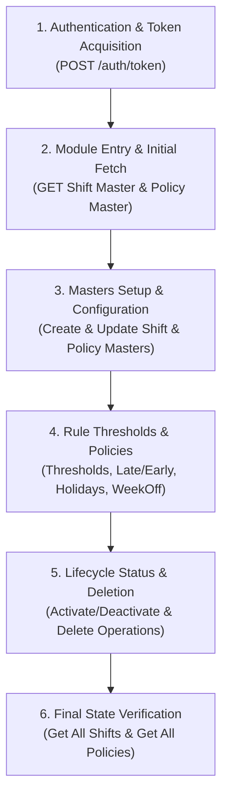

# Attendance Management API — Complete End-to-End Timeline Guide

This document presents the **Chronological Execution Timeline** for testing the complete Attendance Management lifecycle in **Bruno** or **Postman**. It orders the APIs step-by-step from initial employee login $\rightarrow$ entering the Attendance module $\rightarrow$ configuring masters $\rightarrow$ establishing threshold & policy rules $\rightarrow$ lifecycle status toggles.

---

## ⏳ Complete End-to-End Execution Timeline Overview



---

## ⏱️ Chronological Step-by-Step API Execution Guide

---

### 🔹 STEP 1 — Employee Login & Token Acquisition

**Objective**: Authenticate employee credentials and capture the `authToken` required for all downstream API calls.

* **API**: `POST {{authBaseUrl}}/auth/token`
* **Headers**: `Content-Type: application/json`
* **Request Payload**:
  ```json
  {
    "empCode": "{{empCode}}",
    "password": "{{empPassword}}"
  }
  ```
* **Expected Response (`200 OK`)**:
  ```json
  {
    "status": "SUCCESS",
    "data": {
      "empCode": "OMI-0076",
      "token": "eyJhbGciOiJIUzI1NiJ9.eyJzdWIiOiJPTUktMDA3NiIsImVtcElkIjozNCwiZW1wQ29kZSI6Ik9NSS0wMDc2In0.V9rtFbyNH..."
    }
  }
  ```
* **Bruno Post-Response Script**:
  ```javascript
  if (res.status === 200 && res.body && res.body.data && res.body.data.token) {
    bru.setVar("authToken", res.body.data.token);
  }
  ```

---

### 🔹 STEP 2 — Entering Attendance Management Module (Initial Fetch Phase)

**Objective**: Load existing shift configurations and attendance policies upon navigating to `/hcm/attendance`.

* **API 2.1 — Fetch Existing Shifts**: `GET {{attendanceBaseUrl}}/api/v1/attendance/shift/master?page=0&includeDeleted=true`
* **API 2.2 — Fetch Existing Policies**: `GET {{attendanceBaseUrl}}/api/attendancepolicy`
* **Headers**: `Authorization: Bearer {{authToken}}`

---

### 🔹 STEP 3 — Attendance Masters Setup & Configuration Phase

**Objective**: Create and configure standard/custom work shifts and core attendance policies.

#### 3.1 Attendance Shift Master Setup
* **API 3.1.1 — Create Standard Morning Shift**: `POST {{attendanceBaseUrl}}/api/v1/attendance/shift/master`
  ```json
  {
    "shiftCode": "SHF-MIDNIGHT-001",
    "shiftName": "MidNight Shift - Standard",
    "shiftType": "FIXED",
    "applicabilityType": "DEFAULT",
    "startTime": "09:00:00",
    "endTime": "18:00:00",
    "graceMinutes": 15,
    "effectiveFrom": "01-Aug-2026",
    "effectiveTo": "31-Dec-2026",
    "breakConfigs": [
      { "breakName": "Lunch Break", "breakDurationMinutes": 60, "paidFlag": false },
      { "breakName": "Tea Break", "breakDurationMinutes": 15, "paidFlag": true }
    ]
  }
  ```
* **API 3.1.2 — Create Custom Night Shift**: `POST {{attendanceBaseUrl}}/api/v1/attendance/shift/master`
  ```json
  {
    "shiftCode": "SHF-NIGHT-005",
    "shiftName": "Night Shift - Tech Support Team",
    "shiftType": "FIXED",
    "applicabilityType": "CUSTOM",
    "startTime": "22:00:00",
    "endTime": "06:00:00",
    "graceMinutes": 10,
    "effectiveFrom": "01-Aug-2026",
    "effectiveTo": "31-Mar-2027",
    "applicableEmpIds": [3496, 3500]
  }
  ```
* **API 3.1.3 — Get Shift By ID**: `GET {{attendanceBaseUrl}}/api/v1/attendance/shift/master/7`
* **API 3.1.4 — Update Shift Details**: `PUT {{attendanceBaseUrl}}/api/v1/attendance/shift/master/2`

#### 3.2 Attendance Policy Master Setup
* **API 3.2.1 — Create New Attendance Policy**: `POST {{attendanceBaseUrl}}/api/attendancepolicy`
  ```json
  {
    "policyName": "Late Coming",
    "policyHeading": "Late Coming Policy Heading",
    "policyDescription": "Late Coming Policy Description"
  }
  ```
* **API 3.2.2 — Get Policy By ID**: `GET {{attendanceBaseUrl}}/api/attendancepolicy/1`
* **API 3.2.3 — Update Policy By ID**: `PUT {{attendanceBaseUrl}}/api/attendancepolicy/2`

---

### 🔹 STEP 4 — Rule Thresholds & Sub-Policies Configuration Phase

**Objective**: Attach work duration thresholds, grace periods, holiday schedules, and weekly off rules.

#### 4.1 Attendance Status Threshold Rules
* **API 4.1.1 — Save Work Hour Thresholds**: `POST {{attendanceBaseUrl}}/api/attendancethreshold`
  ```json
  {
    "policyId": 1,
    "presentMinHours": 8.0,
    "halfDayMinHours": 4.0,
    "lateGracePeriodMinutes": 15
  }
  ```
* **API 4.1.2 — Get Threshold Rules**: `GET {{attendanceBaseUrl}}/api/attendancethreshold`

#### 4.2 Late / Early Departure Rules
* **API 4.2.1 — Configure Penalty Rules**: `POST {{attendanceBaseUrl}}/api/lateearlypolicy`
  ```json
  {
    "gracePeriodMinutes": 15,
    "maxLateOccurrencesAllowed": 3,
    "penaltyDeductionType": "HALF_DAY"
  }
  ```
* **API 4.2.2 — Get Late/Early Policies**: `GET {{attendanceBaseUrl}}/api/lateearlypolicy`

#### 4.3 Holiday Template Setup
* **API 4.3.1 — Create Holiday Calendar**: `POST {{attendanceBaseUrl}}/api/holidaytemplate`
  ```json
  {
    "templateName": "General National Holiday Calendar 2026",
    "year": 2026,
    "isApplicableToAll": true
  }
  ```
* **API 4.3.2 — Get Holiday Templates**: `GET {{attendanceBaseUrl}}/api/holidaytemplate`

#### 4.4 WeekOff Policy Setup
* **API 4.4.1 — Configure Weekoff Status**: `POST {{attendanceBaseUrl}}/api/weekoff/actdeact`
  ```json
  {
    "weekOffId": 1,
    "isActive": true
  }
  ```
* **API 4.4.2 — Get Weekoff Rules**: `GET {{attendanceBaseUrl}}/api/weekoff`

---

### 🔹 STEP 5 — Lifecycle Operations & Status Management Phase

**Objective**: Test lifecycle actions such as activating, deactivating, and deleting shift or policy records.

* **API 5.1 — Activate / Deactivate Policy**: `PATCH {{attendanceBaseUrl}}/api/attendancepolicy/4/status?action=ACTIVATE`
* **API 5.2 — Toggle Deactivate Shift**: `PATCH {{attendanceBaseUrl}}/api/v1/attendance/shift/master/status/7?action=DEACTIVATE`
* **API 5.3 — Delete Policy**: `DELETE {{attendanceBaseUrl}}/api/attendancepolicy/2`
* **API 5.4 — Delete Shift**: `DELETE {{attendanceBaseUrl}}/api/v1/attendance/shift/master/6`

---

### 🔹 STEP 6 — Post-Execution Verification Phase

**Objective**: Re-verify the full list of active/deleted records to confirm database consistency.

* **API 6.1 — Final Shifts Fetch**: `GET {{attendanceBaseUrl}}/api/v1/attendance/shift/master?page=0&includeDeleted=true`
* **API 6.2 — Final Policies Fetch**: `GET {{attendanceBaseUrl}}/api/attendancepolicy`

---

## 🛡️ Negative & Boundary Testing Matrix

| Timeline Phase | Test ID | Scenario Name | Endpoint Path | Method | Expected Status |
| :--- | :--- | :--- | :--- | :--- | :--- |
| **Step 1 (Auth)** | `AUTH-01` | Missing Password | `/auth/token` | `POST` | `400 Bad Request` |
| **Step 3 (Shift)** | `SHIFT-01` | Duplicate Shift Code | `/api/v1/attendance/shift/master` | `POST` | `400 Bad Request` |
| **Step 3 (Policy)`**| `POL-01` | Missing Policy Name | `/api/attendancepolicy` | `POST` | `400 Bad Request` |
| **Step 5 (Delete)`**| `DEL-01` | Delete Non-Existent ID | `/api/attendancepolicy/9999` | `DELETE` | `404 Not Found` |
